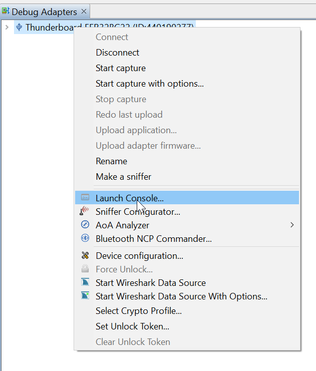

## Introduction

Silabs WSTK, explorer kit, Developper kit (former Thunderboards) and Pro kits integrate a debugger.
This debugger is available in usb or ethernet access. Ethernet is only available on Pro kits.

This debugger offers several interfaces:
- Virtual UART (Serial 0)
- VCOM (Serial 1)
- Admin 
- Debug

Simplicity Studio provides access to those ports using the click right on the debugger Adapter entry and choosing "Launch Console".

Anyway there may be the need for accessing those outside of Simplicity Studio, for example in a test bench.

The purpose of those pages is to explain the way to do this.