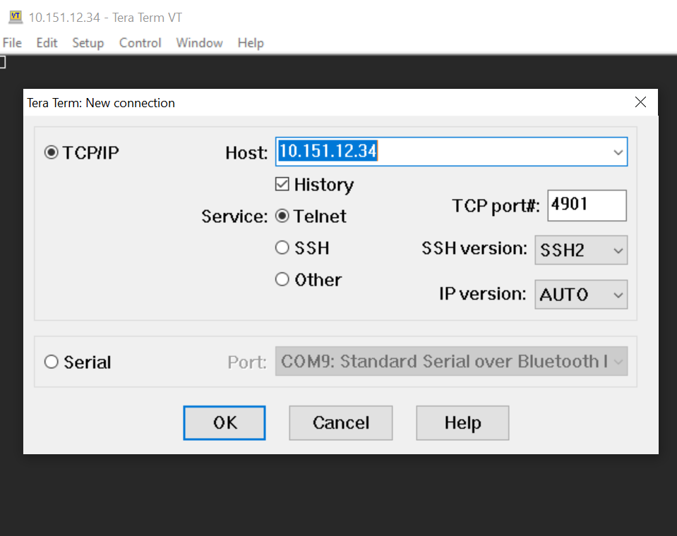

## Using the Ethernet port (Pro kits)

IP address of the Pro kits are discovered in Simplicity Studio neer to its entry name in the Debug Adapter list. 

Once you have identified the WSTK you want to connect to, launch your telnet tool on this IP using the following settings:

- IP
- port

Port are: 

- 4900 for VUART0 console
- 4901 for VCOM console
- 4902 for Admin console

