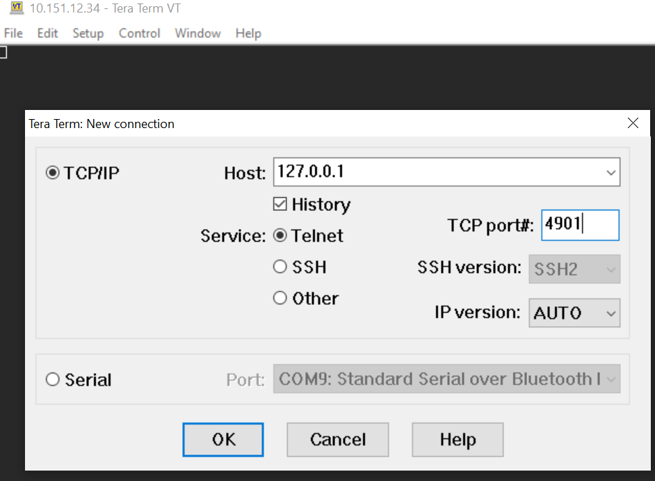

## Using the usb port (all kits)

by default, only the VCOM is accessible, this is the USB port enumerated as "Jlink CDC Uart Port" in your system.

To access virtual COM port or the Admin consoles, you need to run the tool used by Simplicity Studio in the background.

Its name is Silink. It is available in the Simplicity Studio v5 directory:

    ```c
    <Simplicity_Studio_dir>/developer/adapter_packs/silink/silink
    ```

You can run this tool from a command line interface ran in that directory or pointing to it.

To discover your usb kits:

```c
    > ./silink.exe -list
    1 device found.
    0: 440190277, J-Link EnergyMicro
```

To enable its access you can use its entry in the -list:

```c
    > ./silink.exe -addr 0 -automap 4900
    Silink version: 0.5.2b238
    VUART Target connection allowed.
    Mapping channel VUART0 to port 4900
    Mapping channel VCOM0 to port 4901
    Mapping channel ADM_CONSOLE to port 4902
    Mapping channel DCH to port 4905
    OEM:
    Device family: Unknown
    Serial number: 440190277
    silink>
```
alternatively you can use its serial number as listed by -list:

```c
    > ./silink.exe -sn 440190277 -automap 4900
    Silink version: 0.5.2b238
    VUART Target connection allowed.
    Mapping channel VUART0 to port 4900
    Mapping channel VCOM0 to port 4901
    Mapping channel ADM_CONSOLE to port 4902
    Mapping channel DCH to port 4905
    OEM:
    Device family: Unknown
    Serial number: 440190277
    silink>
```

regarding the automap option, remember to use another value outside of the one already generated to add access to more than one usb kit.

Now the access follow the same procedure as previously used for Ethernet access but using the PC IP address as the kit IP.

Launch your telnet tool on this IP using the following settings:

- IP of the PC (or 127.0.0.1 if you run telnet from the same machine)
- port

Port are: 

- 4900 for VUART0 console
- 4901 for VCOM console
- 4902 for Admin console

