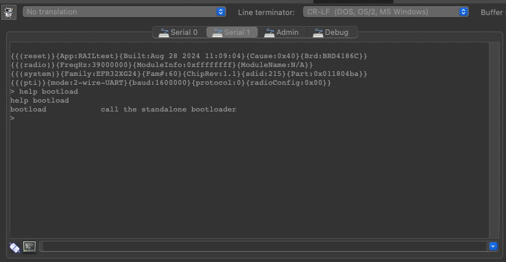

## Procedure

We will understand how to create a single binary to flash containing the bootloader, the main application and at least an OTA image. Additionnal data such as tokens or additionnal OTA images may be combined if the bootloader supports several slots but most cases will be the one described below.

First you need to create:

1. bootloader project, compile it and copy the .s37 file into a temporary folder.
2. application1 project that should be executed at first boot, compile it and copy its .s37 to the temporary folder
3. application2 project that will be stored in the OTA slot and compile it and copy its .s37 to the temporary folder

As application2 is supposed to be flashed through a bootloader upgrade and replace application 1, it is supposed to be in the GBL format. Therefore we will do this with commander as explained in UG162 chapter 6.7.

```c
> commander gbl create application2.gbl --app application2.s37
```

The gbl file is basically a binary file of the application with no base address information (like in a .bin file). To this binary is compiled a header and a footer containing data for the bootloader and checksums for example. Those data are binary coded as well therefore to flash a GBL into the bootloader slot just like the OTA process would have done it, we will rename the .gbl file to .bin to be able to use it as a bin in commander tool.

```c
> cp application2.gbl application2_gbl.bin
```

We didn't change the gbl file content, but now with its .bin type commander will treat it as a binary and accept binary only options.

Finally, to merge all the files in one ready to be flashed we will use the commander convert command as described in UG162 chapter 6.5.

```c
> commander convert bootloader.s37 application1.s37 application2_gbl.bin --address 0x... --outfile combined.s37
```

in the previous command --address tells commander the base address for application2_gbl.bin. the address should be the one of the bootloader defined slots (configured in the bootloader storage slot component)

Your image is ready to be flashed!

## Example

To materialize the above procedure we will generate an example based on any of our Evalution kits. I used the EFR32MG24 RB8186C.

### Bootloader

In Simplicity Studio, select the kit in the debug adapters window of the launcher view and create the bootloader project. I chose the "bootloader storage internal single 1536k" one as the EFR32MG24 has a 1.5MB flash.

note the slot base address from Bootloader Storage Slots component. here 0x80c0000. This will be used to offset the OTA image later on.


Compile and copy the bootloader-storage-internal-single-1536k.s37 file in a temporary folder.

### Application1 : Railtest modified with bootloader support

In Simplicity Studio, select the kit in the debug adapters window of the launcher view and create the Railtest project.

Follow the instructions of [this tutorial ](https://siliconlabs-southemea.github.io/ProprietaryRF/Applications/Railtest/Adding_Bootloader_Support/)to add bootloader support and bootload command to the CLI interface.

Compile and copy the rail_soc_railtest.s37 file in the temporary folder you created at the bootloader step.

### Application2: Cli Baremetal with bootloader support

In Simplicity Studio, select the kit in the debug adapters window of the launcher view and create the Cli Baremetal project.

Follow the same instructions as for application1 to add the Application Interface component to the preject.

Compile and copy the cli_baremetal.s37 file in the temporary folder you created at the bootloader step.

### Generation of the single s37 file

Now we have all the base files in our temporay folder.

We will generate the gbl from the cli_baremetal.s37 and copy it to a .bin file:

> ```c
>> commander gbl create cli_baremetal.gbl --app cli_baremetal.s37
>> cp cli_baremetal.gbl cli_baremetal_gbl.bin
> ```

Now we generate the single s37 file:

```c
> commander convert bootloader-storage-internal-single-1536k.s37 rail_soc_railtest.s37 cli_baremetal_gbl.bin --address 0x80C0000 --outfile combined.s37
```

### Test

You can now flash the combined.s37 file to your board.

In Simplicity STudio open the console for your kit and select Serial1 tab. This is the VCOM view for your application.

On boot, you should get a prompt as Railtest is the active application flashed in your kit.

you can check that typing "help bootload" and get the help message for the bootload command we added in the Application1 step!



if this is the case, congratulation, Railtest with the modification is running!

now if we issue the "bootload" command at the prompt, part will call the bootloader and update Railtest application with the CLI baremetal one.

At the end of this sequence, a reboot is executed, bootloader sees a valid application to run and execute it. 

You should now get the CLI baremetal prompt!


